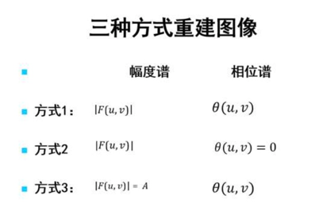

# 图像分析基础作业简介
task1无需做，因此删除了，task2——>task1，依次顺延  

1.使用matlab或python对随机一张灰度图片进行线性、分段线性、非线性的点运算，对比原图和进行灰度变化后的效果  

2.用matlab或python编程实现（可以不使用工具包提供的函数）图像的平移，镜像和旋转，以及这三种几何变换的复合  

3.用matlab或python编程实现以下三种情况的傅里叶反变换，进而比较复原图的区别，理解傅里叶变换后的幅度谱和相位谱  
  

4.阅读何凯明的基于暗通道先验的图像去雾论文，并用matlab或python复现其中去雾算法  

5.使用matlab或python实现维纳滤波，要求：比较信噪比未知，信噪比已知，图像和噪声自相关函数已知，这三种情况下的图像复原结果  

6.使用DPCM编码。对随机一张灰度图片进行编码和解码，比较不同量化器（1-bit，2-bit，4-bit，8-bit）的重建图像区别，并计算重建图像的PSNR和SSIM值  

7.用matlab或python语言实现大津法和迭代阈值分割，并实验比较两者的性能差别  

8.使用Opencv实现分水岭算法，并进行测试。
